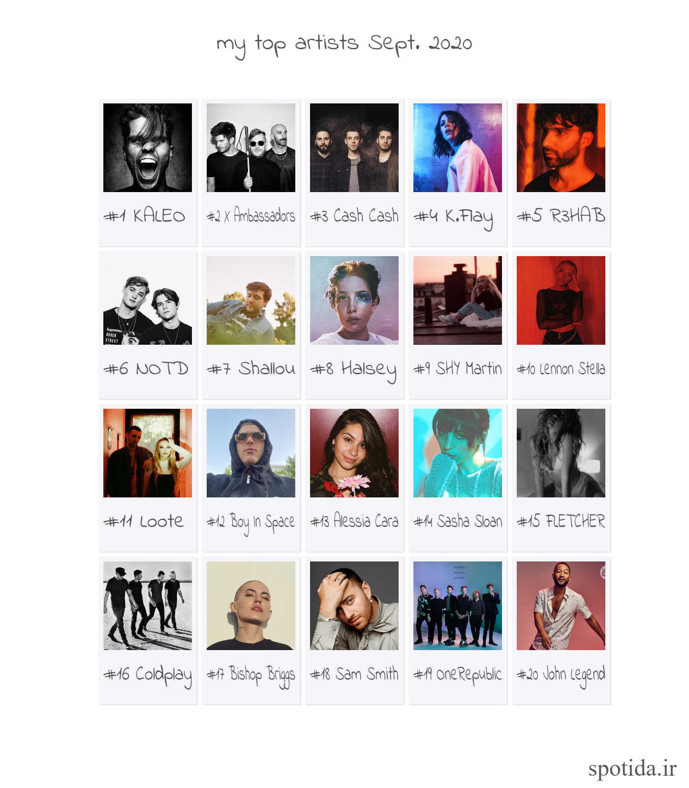

# Spotida
Visualize your Spotify data and more.  
## Dashboard
See your data in a glance.  

## Create Playlists
- Top artist playlist: create a playlist base on top tracks of your top artists  
- Top tracks playlist: create a playlist base on your top tracks
- Custom playlist: Create a playlist using spotify recommendation api

## Visualize your top tracks/artists
Generate Images from your top tracks/artists
 
 
## Contribution
### Developers
As a developer you could create a playlist creator, 
mine some valuable data to show on the main dashboard or create an image generator.
### Designers 
As a designer you could create issues and submit your design suggestion about UI/UX of the website. 
Or design a layout for the image generation section.

## Share your data
You could share your data from "Help Us" tab,
 and we will share them on [Kaggle](https://www.kaggle.com/) in 1000 chucks.  